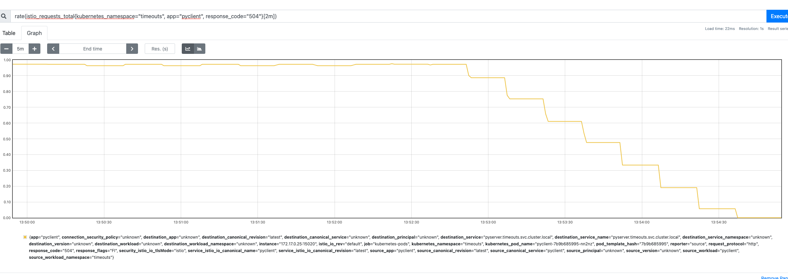

Istio timeout demo

https://istio.io/v1.7/docs/tasks/traffic-management/request-timeouts/

An appropriate retry count and the interval between retries depend on the type of the request and underlying operation that is being performed. For example, you don’t want to use exponential backoff if you know a user is waiting for a response as that would make for bad user experience. The exponential backoff strategy or strategy using incremental intervals might be better suited for background operations, while interactive operations (user interface) should be handled by an immediate or constant interval retries might work better. It is also essential to test and optimize your service retry strategy to come up with the solution that works best.


```
# fyi I am using python 3.9.6 and assume you have some sort of local kubernetes setup, or have access to EKS, etc. I also assume you have some working knowledge of kubernetes and istio/envoy.

# it's always a good idea to create a virtualenv, and remember to activate it, go into your code repo / root folder
> python3 -m venv ~/.venvs/circuitbreaker
source  ~/.venvs/ratelimiter/bin/activate

If you are are like most of us, you have performed some actions that override default pip - https://confluence.grainger.com/display/PLE/Using+AWS+CodeArtifact#UsingAWSCodeArtifact-PIPPIP

so you must dpctl pip-login first then:
> pip3 install -r requirements.txt

# to depoly onto minikube remember to set the minikube docker context; this is so that your minikube has access to your docker image
> eval $(minikube -p minikube docker-env)  

# then build the docker images for the test apps
# server
> docker build -t pyserver --file Dockerfile_server .

# client
> docker build -t pyclient --file Dockerfile_client .

## minikube 
# create a new namespace
> kubectl create namespace timeouts

# enable sidecar injection
> kubectl label namespace timeouts istio-injection=enabled --overwrite

# check to see if your namespace, circuitbreaker is enabled
> kubectl get namespace -L istio-injection

# deploy the app
> kubectl apply -f deployment/deployment.yml -n timeouts

# open the tunnel
> minikube tunnel

# curl the server, it takes about 2 seconds to return
curl -v localhost/index 

# change the virtual service to add a 2 second delay - you will notice i added the mesh to the gateway which applies it to the internal calls also then, I don't have a load balancer (DNS) set up and to be honest not too sure how to set that up locally.  So now you can no longer curl localhost/index anymore
# https://istio.io/latest/docs/ops/common-problems/network-issues/#route-rules-have-no-effect-on-ingress-gateway-requests
> kubectl apply -f deployment/virtualservice_delay.yml -n timeouts

# curl the client now, note you can no longer curl the server directly anymore, this will take about 2 seconds
> curl -v localhost/home

# apply the timeout to the client
> kubectl apply -f virtualservice_timeout.yml -n timeouts

# curl the client
> curl -v localhost/home
*   Trying ::1...
* TCP_NODELAY set
* Connected to localhost (::1) port 80 (#0)
> GET /home HTTP/1.1
> Host: localhost
> User-Agent: curl/7.64.1
> Accept: */*
>
< HTTP/1.1 504 Gateway Timeout
< content-length: 24
< content-type: text/plain
< date: Wed, 11 Aug 2021 23:29:10 GMT
< server: istio-envoy
<
* Connection #0 to host localhost left intact
upstream request timeout* Closing connection 0

# now let's reset everything to where there are no delays and/or timeouts
> kubectl apply -f deployment/deployment_client.yml -n timeouts
> kubectl apply -f deployment/deployment_server.yml -n timeouts

# now on the server lets return a 504 instead of doing a 2 second delay, remember that we did not apply a timeout on the client
> kubectl apply -f deployment/virtualservice_timeout_504.yml -n timeouts

> curl  -vv http://localhost/home
* TCP_NODELAY set
* Connected to localhost (::1) port 80 (#0)
> GET /home HTTP/1.1
> Host: localhost
> User-Agent: curl/7.64.1
> Accept: */*
>
< HTTP/1.1 504 Gateway Timeout
< content-type: text/html; charset=utf-8
< content-length: 18
< server: istio-envoy
< date: Thu, 12 Aug 2021 18:52:45 GMT
< x-envoy-upstream-service-time: 11
<
* Connection #0 to host localhost left intact
fault filter abort* Closing connection 0


## Metric for failing
# in prometheus I queried using
rate(istio_requests_total{kubernetes_namespace="timeouts", app="pyclient", response_code="504"}[2m])

```
Prometheus chart for monitoring timeouts


